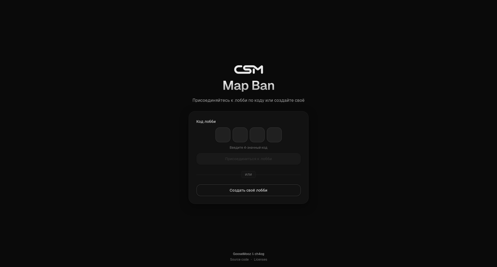

<!-- SPDX-FileCopyrightText: 2025 CyberSport Masters <git@csmpro.ru> -->
<!-- SPDX-License-Identifier: CC-BY-SA-4.0 -->

# CSM Mapban

[](https://api.reuse.software/info/git.in.csmpro.ru/csmpro/csm-mapban)
[](https://git.in.csmpro.ru/csmpro/csm-mapban/releases/latest)
[](./LICENSE)
[](https://mapban.csmpro.ru/)
[](https://git.in.csmpro.ru/csmpro/csm-mapban)

CSM Mapban is a modern map veto and pick tool for tournaments, featuring
live-synced lobbies and OBS-ready overlays.



<p>
  The project was originally created by
  <a href="https://github.com/goosemooz" style="display:inline-block; margin-top:4px;">
    
    @goosemooz
  </a>,
  and is now developed and maintained by
  <a href="https://github.com/ch4og" style="display:inline-block; margin-top:4px;">
    
    @ch4og
  </a>,
  with full respect and acknowledgment to the original author and friend of mine.
</p>

## Features

- Clean, responsive UI
- Admin mode or auto start when two teams join
- Real‑time sync via WebSockets
- OBS overlay (browser source)
- Configurable map pools/modes and card colors

## Getting Started

### Production Deployment

For production deployment, you need to configure a reverse proxy (nginx, Caddy,
etc.) to route API requests to the backend:

Example nginx configuration:

```nginx
server {
    listen 80;
    server_name your-domain.com;
    
    location /api/ {
        proxy_pass http://backend:4000;
        proxy_http_version 1.1;
        proxy_set_header Upgrade $http_upgrade;
        proxy_set_header Connection 'upgrade';
        proxy_set_header Host $host;
        proxy_cache_bypass $http_upgrade;
    }
    
    location / {
        proxy_pass http://frontend:3000;
        proxy_http_version 1.1;
        proxy_set_header Upgrade $http_upgrade;
        proxy_set_header Connection 'upgrade';
        proxy_set_header Host $host;
        proxy_cache_bypass $http_upgrade;
    }
}
```

### Using Prebuilt Images (Docker)

The easiest way to run CSM Mapban in production:

```bash
docker run -d git.csmpro.ru/csmpro/csm-mapban/backend:latest
docker run -d git.csmpro.ru/csmpro/csm-mapban/frontend:latest
```

Or with docker compose:

```bash
wget http://git.in.csmpro.ru/csmpro/csm-mapban/releases/download/latest/docker-compose.yml
docker compose up -d
```

### Using Nix Package

Use Nix package:

```bash
nix run git+https://git.csmpro.ru/csmpro/csm-mapban
```

## License and Trademark Notice

### REUSE Compliance

This project is fully compliant with the
[REUSE Specification 3.3](https://reuse.software/spec-3.3/).

- Wherever technically possible, each source file contains SPDX-compliant
  license and copyright information directly in its header.
- For files where inline annotations are not feasible (for example, binary
  assets), the relevant information is provided in [.reuse/dep5](./.reuse/dep5).
- All license files can be found in the [LICENSES](./LICENSES) directory.

### Source Code License

The source code of this project is licensed under the **[GNU Affero General
Public License v3.0](./LICENSE) (AGPLv3-only)**.

The code is developed and maintained by **CyberSport Masters**.

### Trademarks

The **CyberSport Masters** and **CSM** logos are registered trademarks. They may
not be used, copied, modified, or distributed without explicit written
permission. Detailed rules on trademark usage can be found in the
[CyberSport Masters Trademark Policy](./LICENSES/LicenseRef-CyberSportMasters.txt).